# Creating Image Processing Filters with (near) vanilla Python
## Part 1: Photo effects

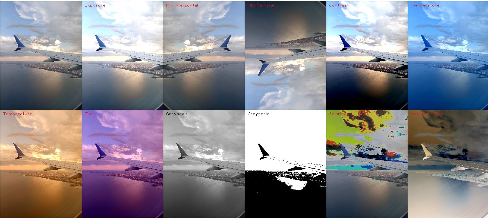

For each of the photo filters, many of the processing steps are similar, such as splitting the 
image into its 3 channels (RGB), clipping the values between 0 and 255 and converting them to 
integers. For each of these tasks I created functions that are called where needed in each filter.
The split function takes the img array as an input and returns three 1D arrays of the R, G and B 
channels.

The clipping function takes an array as input and uses the numpy clip function to limit the array to 
values between 0 and 255.

The convert_to_int function takes an array as input that is typically filled with float values and 
returns the array converted to integers.

### Exposure Filter
My implementation of the exposure filter is to add the original color value multiplied by a fraction of 
the input and 255. This ensures the blacks stay black and the brightness is increased proportionally. 
F(C,amt) = C + C(amt/255)
I think this is a reasonable implementation because it avoids the issue of faded blacks when you 
increase every pixel by the same amount.

### Contrast Filter
There are many different interpretations as to how a contrast filter should be applied to an image. In 
essence it needs to increase the distance between all the values in the image. However, this can 
have unintended consequences on the colour of the image and perform strangely in dark or bright 
regions if not implemented correctly.
To adjust the contrast, I created a function that takes the image and a value between 0.5 and 2 as 
input. The formula I found that gave the most reasonable results is as follows: 
F(C,amt) = (C-128) * amt + 128
The resultant images resembled the same effect for when I applied a similar amount of contrast to 
an image in photoshop. This is a useful filter for when you are trying to create more defined edges in 
an image to perhaps be detected by an edge detection filter.

### Temperature Filter
To adjust the temperature I created a function that takes the image and an amount as a parameter.
The Input parameter can range from -100 to 100. Positive values will make the image look warmer 
and negative values will make the image look cooler.
To make the image warmer the input amount is added to 
each pixel in the red channel and subtracted from the blue 
channel. When a negative value is used as a parameter the 
inverse operation is performed. The blue channel is 
increased and red decreases.
This is typically the method used in photoshop to adjust the colour balance of an image.
This filter could be useful when the camera doesn’t calculate the correct white balance for an image 
or when a warmer or cooler look is desired.

### Tint Image
The tint function operates similarly to the temperature filter with the same inputs of the image and 
an amount ranging from -100 to +100. The function has the same functionality as the middle slider in 
the photoshop screenshot above. Positive values will make the image look greener and negative 
values will make the image look more magenta. 
This filter could be useful when the camera doesn’t calculate the correct white balance for an image.

### Binary Image filter (Thresholding)
The function I used to create a binary image takes the image and an integer between 0 and 255 as 
input. It first converts the image to greyscale using the filter described above. It then loops through 
each pixel in the image and checks if the value of the pixel is above or below the input value.
If it is below, the value of the pixel is changed to black and if it is equal or higher it is set to 255.

### Solarization & Inverting
To invert the images, I multiplied all the pixels in each channel by -1 and then added 255.
My interpretation is that the solarization filter is where in photography the image is recorded on a 
negative or on a photographic print for too long and the bright areas of the image become inverted. 
For this I did the same as for inverted except added an if statement that checks it’s above a certain 
threshold and put it in a for loop that loops over every pixel in each channel
Solarization is more of a novel effect, but the invert filter could be useful for inverting binary masks.

### Image Flip Horizontal and Vertical
I created two filters to flip in either the horizontal or vertical direction. They both create an empty 
array and fill it using the original image pixels in reverse order.
It’s useful for creating mirrored images or for creating more training data for a machine learning 
model.

### Greyscale Filter
There are many ways to convert an image to greyscale. The goal is to maintain the same luminance 
as the original image and to have the dark and bright areas appear as would be expected by the 
human eye.
The image must first be gamma corrected because the input rgb likely has a gamma compression 
function applied to it.
The human eye is more sensitive to certain colours more than others. Because of this each of the 
channels are weighted before being added together to form the final image. Green gets the highest 
weight at 0.7152 and Blue has a weight of 0.0722. The human eye is a lot more sensitive to green 
light than blue.
 Y = 0.2126*r + 0.7152*g + 0.0722*b
Each pixel then needs to be gamma compressed to be converted back to the typical non-linear sRGB 
representation. 
Converting an image to greyscale is useful for many reasons. It reduces the data needed to store the 
image by three-fold, it can make it easier to visualize other data in the image, it can also be used for 
novel reasons like imitating old photos and films.

## Sharpening, Blur, and Noise Removal

For this I created several extra functions, which include:
Two convolution functions used to traverse the image for any input feature. One function is for 3D kernels, to be used on rgb images and the other is for 2D kernels to be used on greyscale images. They operate similarly by iterating over each pixel in the image and extracting a region of interest (ROI) to be multiplied by the normalized kernel. It then saves the resultant pixel to the new output image.
A padding function which takes the image and a given kernel as input and returns the image with the outer pixels duplicated as padding. The width of the padding is half the width of the input kernel.
A normalizing_kernel function which takes a kernel and normalizes the values so that they all add up to 1.
A show_kernel and show_ROI function which converts the kernel or ROI to an uint8 array, scales it by 15 fold and displays it to the screen. This was frequently used to debug the code and track the progress of a convolution filter.

### Box Blur (Softening)
To implement box blur I created a kernel with all the same values and normalized it.
I then used the convolution function I created to apply the kernel to every pixel in the image.
The result is a blurry image that performs questionably on sharp corners or narrow regions of colour.

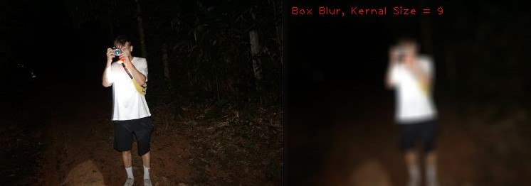

### Gaussian Blur (Softening)
To implement gaussian blur, I created a function that takes a width and returns a normalized kernel with a gaussian distribution of values around the centre. This kernel is then applied to every pixel in the image using the same convolution function as before.

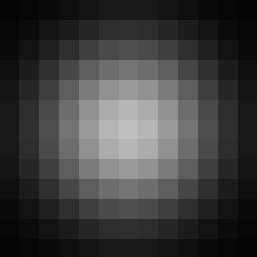</img>
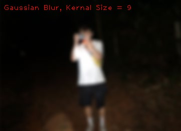</img>

### Sharpening Filter (Sharpening)
To implement the sharpening filter I created a 3x3 kernel that had 5 in the center and was surrounded by -1 values. The function for the sharpening filter takes an amount as a parameter which is used to vary the sharpening amount by multiplying the kernel by the parameter and then normalizing the kernel so that it doesn’t affect the brightness of the image.
The kernel is then applid to the image using the 2D convolution function described earlier.

</img>

### Unsharp Masking
Unsharp masking is another technique used to sharpen an image. It Finds the significant edges of an image by first blurring the image and then comparing the blurred image with the original by subtracting them. The difference is then added to the image so that edge pixels become more pronounced. Below are the different steps used to unsharp mask the image, applied to the red channel. The middle image has been normalized between 0 and 255 but in practice it has both negative and positive values. (See the end of the section for results comparison.)

</img>
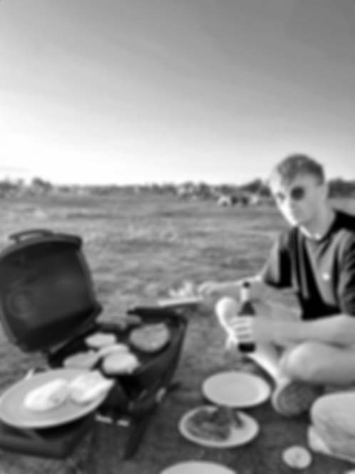</img>
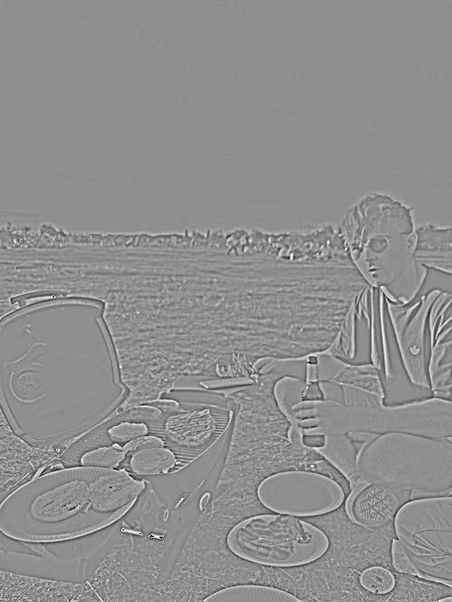</img>
</img>

### Sobel Filter
The Sobel filter is often used to detect edges in computer vision. It is implemented by applying a kernel convolution across the image in the vertical and horizontal direction that accentuates changes in pixel brightness. For my implementation I first converted the image to greyscale using the greyscale filter I created earlier. The kernel I used was a 3x3 kernel that has -1 in the firs column, 0 in the second and 1 in the third. The same kernel is used for the vertical axis except it is rotated by 90 degrees. The output of the vertical and horizontal convolutions are added together and divided by 2 to generate the output shown below.

</img>
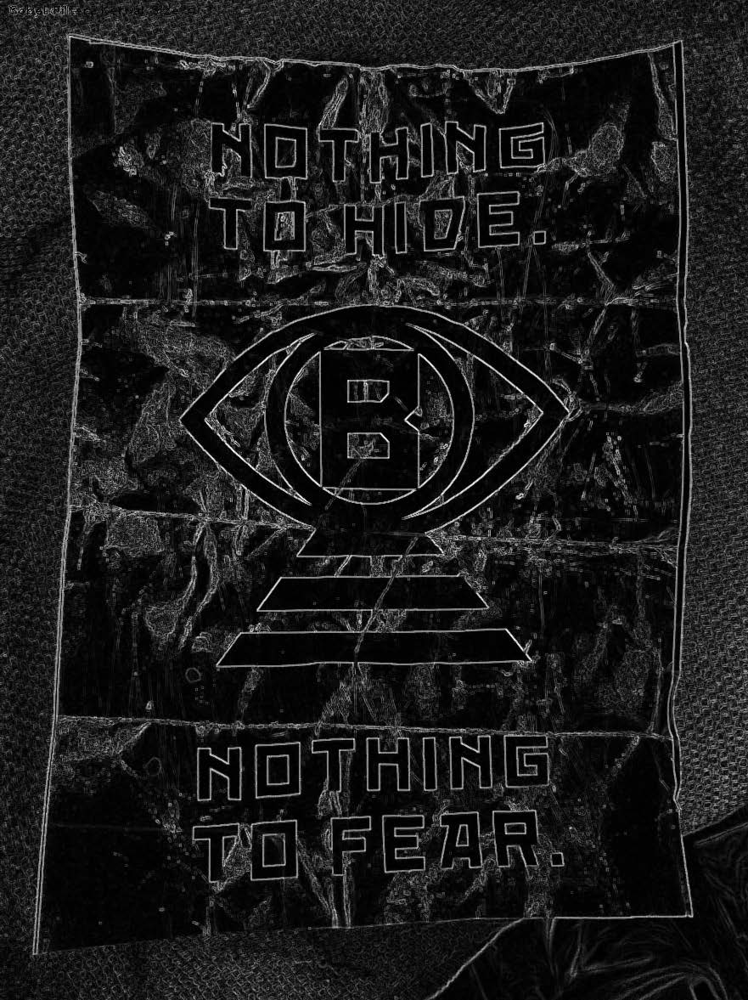</img>

### Median Filter (Non-Linear Diffusion)
The function I created for median filter takes the original image and the size of a kernal as input and outputs the image with the median filter applied to it. It uses the same padding function as the other filters but the convolution is applied differently.
For each region of interest (ROI) that the kernel passes over it sets the output pixel to the value of the median of all the ROI pixels sorted from lightest to darkest.
This filter will remove outlying pixels and reduce small noise in an image. As can be seen in the image below, the whole image appears smoothened. Large scale noise such as that in the sky remains but higher frequency noise, such as that on the person’s arm in the foreground is removed.

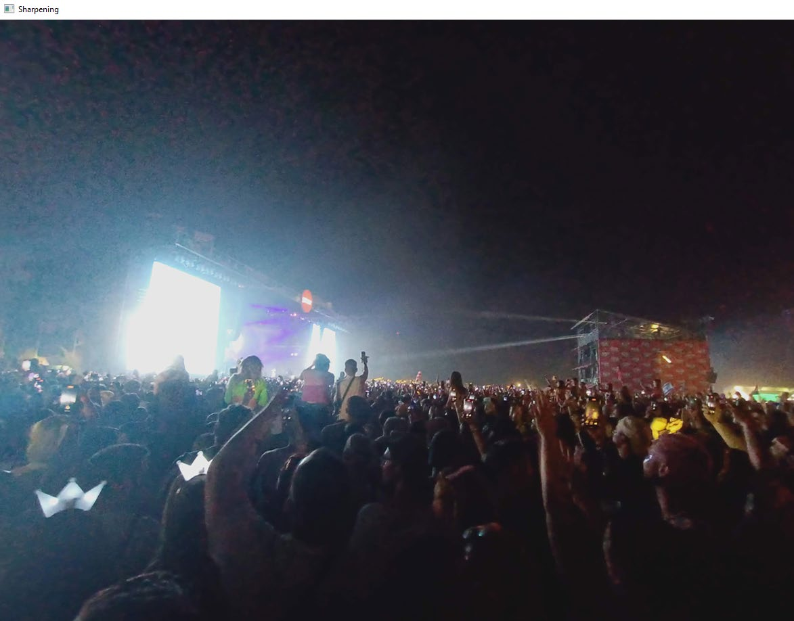</img>
</img>

### Bilateral Filter (Non-Linear Diffusion)
The bilateral filter works similary to the gaussian blur filter, except that the kernel is only influenced by pixels with values similar to the affected center pixel. This means that where there is a harsh edge or change in color the new pixel won’t be affeted by any pixels on the far side of the edge.
The function for this filter takes the kernel size, sigma and a threshold as inputs and outputs the affected image. It starts off similarly to the other convolution filters by padding the image, creating an empty output array and then iterating over every pixel in the output array.
For every pixel in the output image a new gaussian kernel is created. A region of interest ROI the same size as the kernel is extracted and the lightness each pixel is compared to that of the center pixel. The lightness (R+G+B) is the measure I used to determine if there was a significant enough change for the pixel to be considered by the kernel. This method saves significant computational time by not having to add a for loop to itereate over each color channel.
If the difference between the centre pixel and a given pixel in the ROI was greater than the threshold (40 seemed to produce good results), then the kernel would set the value at that point to zero.
Difference = absolute value ( ROICenterPixel (R+G+B) – ROI ( R+G+B))
If (Difference > 40)
Kernel [i,j] =0
After each pixel in the ROI was considered, the kernel was normalized so that the brightness of the image wouldn’t change. The impact of the kernel was then applied to the ouput pixel and the loop starts again on the next output pixel.
Below are examples of the kernels and their corresponding ROI (before they have been normalized).
Bilateral Filter Results:
I took this picture on a walkway in Sydney, I used a high very high iso with a fast shutter speed, which resulted in a very grainy image, in particular on the path beneath the lamp.
I thought the results from the filter were fantastic and really removed a lot of the noise while keeping the details of the buildings and trees.
Other implementations of bilateral filters change the size of the filter depending on the proximity to an edge, or wight each pixel in the kernel as opposed to setting the value to zero. I didn’t get the chance to implement these techniques, but I would imagine their effects would be similar.

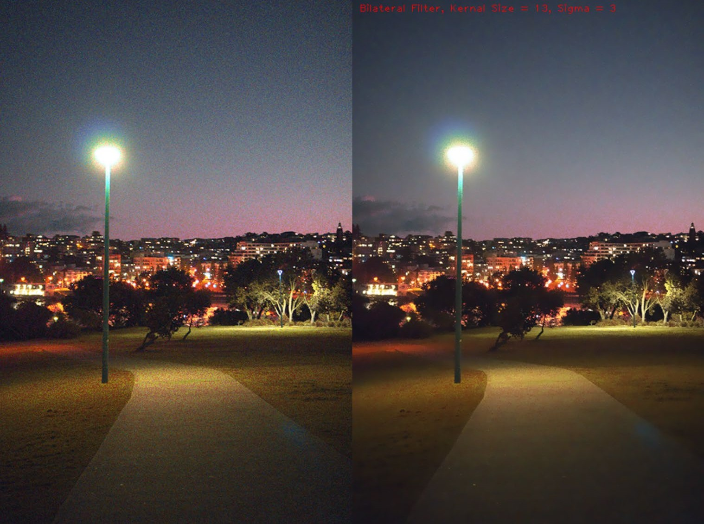</img>

## Results Comparision
### Sharpening vs Unsharp Masking

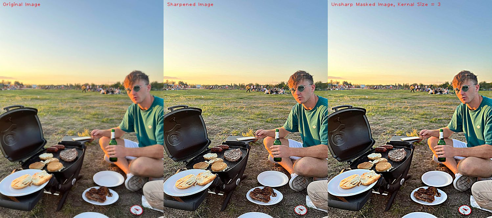</img>

### Box Blur vs Gaussian Blur

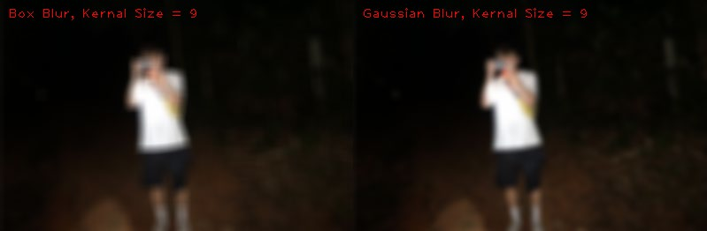</img>

The Gaussian Blur solution seems to give an arguably better result than box blur, the corners of the t-shirt in the image are more rounded and the arm on the left is less of a mess. The gaussian filter is round compared to box filter so the blur more closely resembles that of a camera lens or of our eyes.

### Median Filtering vs Bilateral Filter
These are both non-linear diffusion techniques and when applied to the above image both of these techniques removed quite a lot of noise from the image. Both filters can be adjusted using the parameters, but these results seemed reasonable to compare the two.
It does appear that the Bilateral Filter performs substantially better than the median filter.
What is most attractive about the bilateral filter is that the sharp edges and high frequency details have been preserved. When comparing the horizon line of people’s heads, in the median filter photo with that in this one, there is a lot more detail remaining in the image.

</img>
</img>

## Part 3: High-quality image resampling

### Nearest Neighbour Scaling (Both)
Nearest neighbour scaling can be used for either up or down sampling an image. I use it in this section to demonstrate the effects of various minimizing techniques as it useful when you want to preserve the details of each pixel in the image and not add any estimations as to how the image should look when scaled. This is particularly useful for pixel art and for examining the effects of minimizing filters.
My nearest neighbour function takes an amount as a parameter and multiplies that by the input image to determine the output image height and width. Amounts less than 1 will shrink the image while numbers greater than one will scale up the image.
The pixel value for each point on the output image is determined by finding the nearest corresponding pixel on the input image. The index of the corresponding pixel is found by multiplying the ratio of the output image shape to the input image shape with the index on the output image.
Pixel art best illustrates the functionality of this scaling technique. This image of a house has details that are only one pixel in size, and they need to preserve their square shape when scaled.

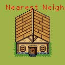</img>
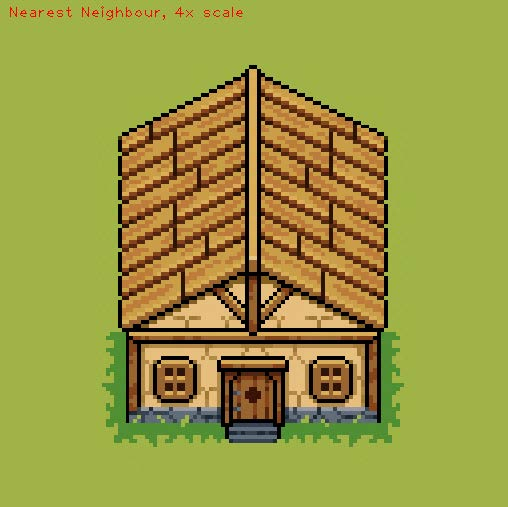</img>

### Sub-Sampling (Minification)
The technique I used for subsampling is to apply a convolution to the input image, however unlike before where the kernel would iterate over every pixel, it now moves across the image in steps equal to the width of the kernel.
The function takes the image and kernel size as input, and outputs the resultant image, which will be a quarter the size if the kernel is 2x2 or a ninth the size if the kernel is 3x3.
This implementation takes the median pixel of the ROI to be used in the output image.
Below are the synthetic images with a high resolution on the left and a low resolution on the right. They have been subsampled and subsequently up sampled using nearest neighbour scaling, which will be discussed next.
Original Image:
1st sub_sample (quarter)
2nd sub_sample (eighth)
3rd sub_sample (sixteeth)

</img>
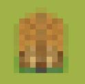</img>

### Gaussian Pyramid (minimizing)
The gaussian pyramid is a minimizing technique used to down sample an image, that aims to outperform standard sub-sampling, by slightly blurring the image before it sub-samples the image.
def gaussian_pyramid(image):
image = gaussian_blur(image,3)
image = subsample_image(image)
return image
Below is a natural image taken on Ticknock Hill Dublin, with lots of high frequency detail in the rocks on the mountain bike train.
The following 4 images are the 4 layers of a gaussian pyramid that have been repeatedly blurred and sub-sampled. The images have then been up sampled using nearest neighbour scaling so that they can be accurately compared.

</img>
</img>

### Gaussian Pyramid with Bilateral Filter
To try fix the overly smooth look of the scaling with the gaussian filter, I decided to try the pyramid using the bilateral filter I created in part 2.
To do this I simply swapped out the gaussian blur function I was using with the bilateral filter.
The first image is the input image of a building in Paris with lots of high frequency detail.
It has been down sampled from 1000x1000 to 500x500 and then upscaled using NN to see the results.
The results are quite good and appear to resemble just subsampling the image without the over smoothing problem we saw with the previous gaussian pyramid but see the next section of the report for a better comparison.

</img>
</img>

### Bilinear Interpolation Scaling
Bilinear Interpolation works similarly to nearest neighbour (NN) scaling in that it can be used to up or down sample an image. It also traverses the output image and uses the corresponding pixels of the input image to determine the output.
The difference is that bilinear interpolation takes weighted average of the pixels near it as opposed to just the median. This creates the ability to create new pixel information as opposed to just copying existing pixel colours like with NN.
Below is a 10x10 pixel gradient I created to test it. It’s first been upscaled with NN, and then with bilinear interpolation

## Part 4 Results Comparison:

### Sub-Sampling VS Gaussian Pyramid VS Gaussian Pyramid with Bilateral Filter (Minification)

</img>
</img>
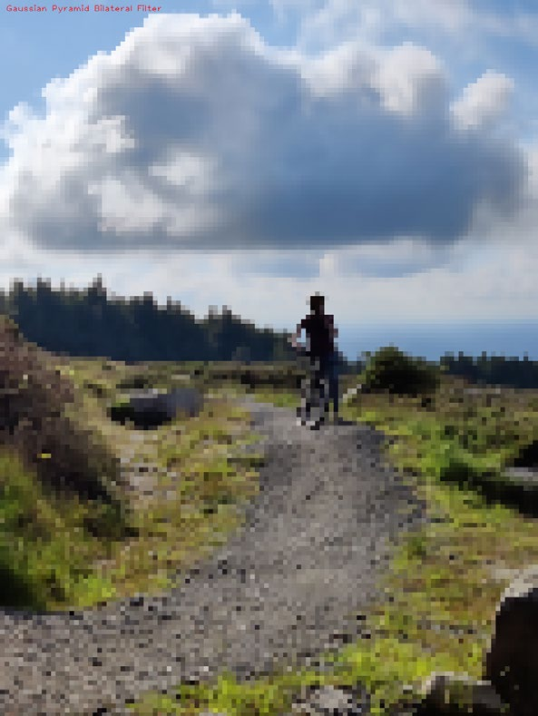</img>

These three images have all been sub sampled 4 times. The two gaussian pyramid were blurred in between each sub-sample, the first with a gaussian blur and the last image with a bilateral filter.
The first and third images look very similar, probably due to their low resolution almost resembling pixel art.
The blurring in the second image helps in certain areas like creating smooth lines on the rock in the bottom right, and making the person’s head look round. However, I think in this instance the other two images look much better.
The gaussian pyramid image could also probably be improved by adjusting the blur amount for each iteration. For these images I used a kernel of 3, and a sigma of 3 in the blur filter.
Sub-Sampling Gaussian Pyramid Gaussian Pyramid w/ Bilateral Filter

### Nearest Neighbour VS Bilinear Interpolation (magnification)
Below is the same low resolution house used in NN scaled compared with the Bilinear Interpolation technique.
The effect of bilinear interpolation is clear here because of the new interpolated pixels in the image, making it look blurred, whereas the nearest neighbour scaled image is still sharp and has clearly defined edges.

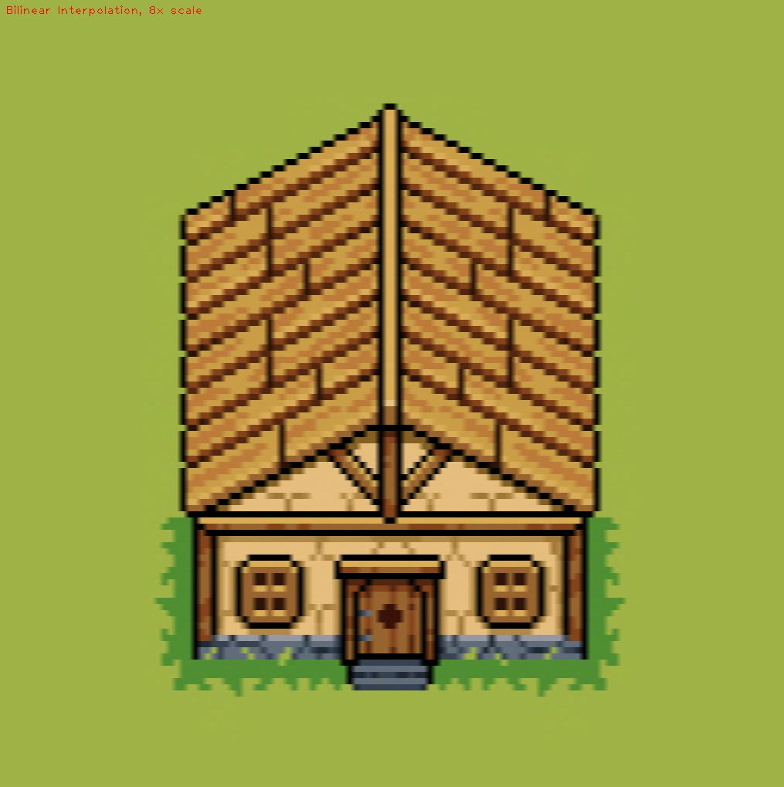</img>
</img>

Below are the same two natural, low-frequency images, upscaled from 250x250pix to 500x500pix.
The bilinear scaling gives in much smoother edges, in particular diagonal edges. But it does look a little blurrier and some of the contrast is lost in the image. This is clear from the eyes and the trees in the background.
In general though I would choose Bilinear scaling (or ideally bicubic, but we won’t go there) for scaling natural images like this one.

</img>
</img>

